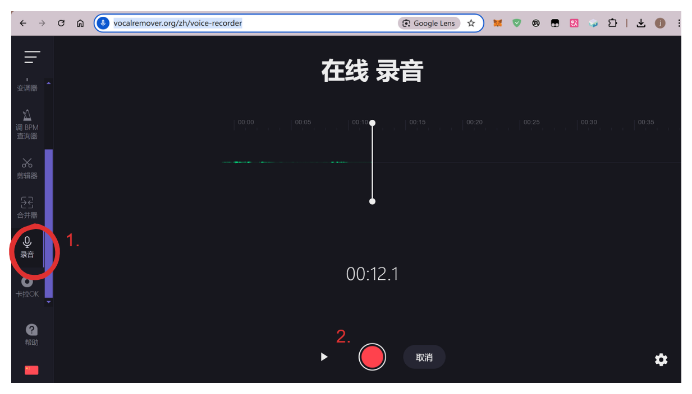
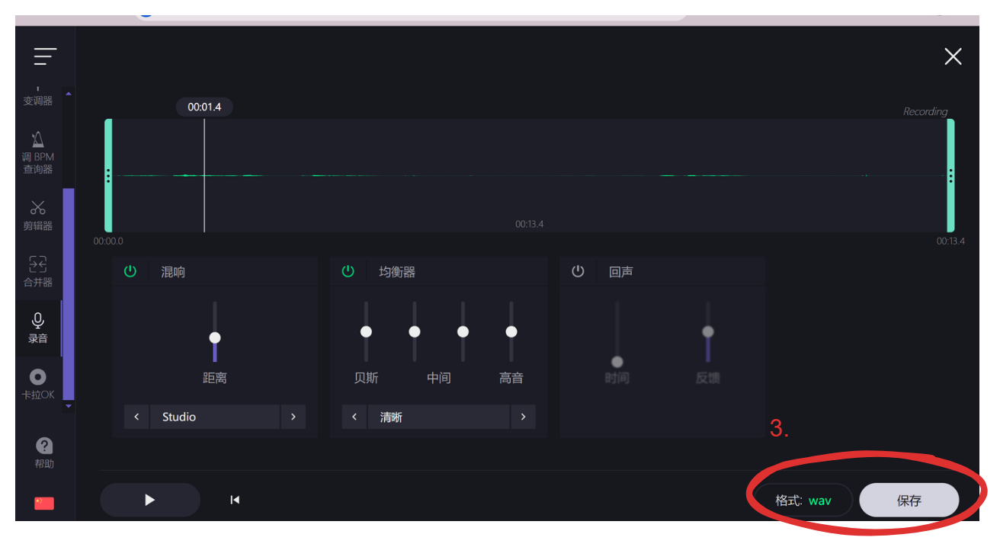
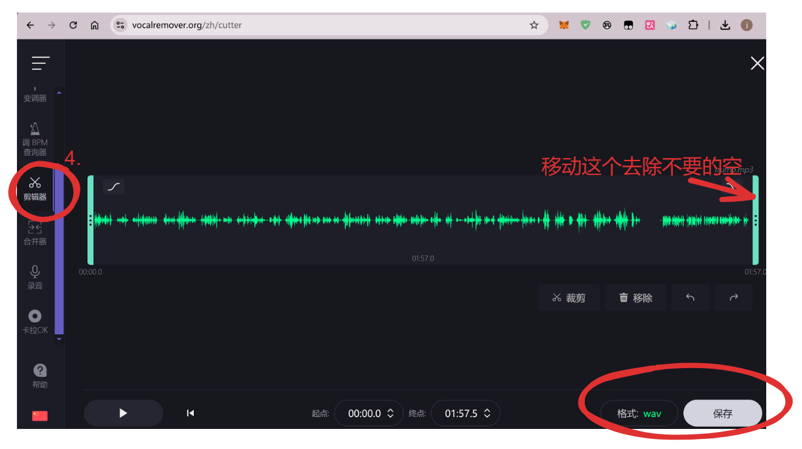
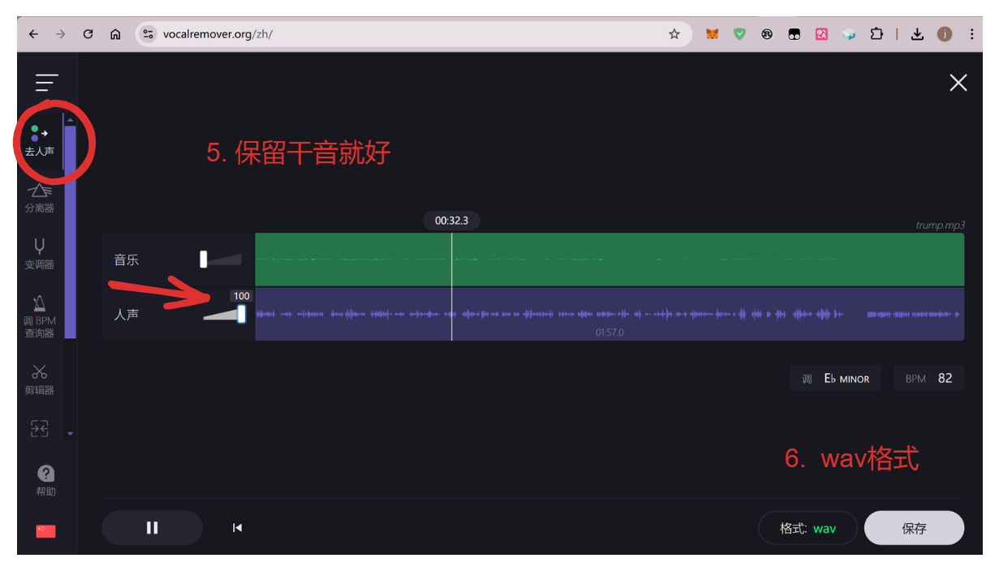

# 在线音频切割器
**https://vocalremover.org/zh/cutter**

## 1. 录音(要有麦克风)， 或者手机打开网站开启
**https://vocalremover.org/zh/voice-recorder**

## 2. 保存并且编辑

## 3. 裁剪音频片段, 1 -3 个 10-30s 片段

## 4. 保留人声, 干音

## 5. 最后用处理过的1-3个 10s 内的wav文件就好
clone a voice submit the filename of a wave file containing the source voice

voice cloning works best with a 22050 Hz mono 16bit WAV file containing a short (~5-30 sec) sample of the target speaker's voice. The sample should be a clean recording with no background noise or music.
